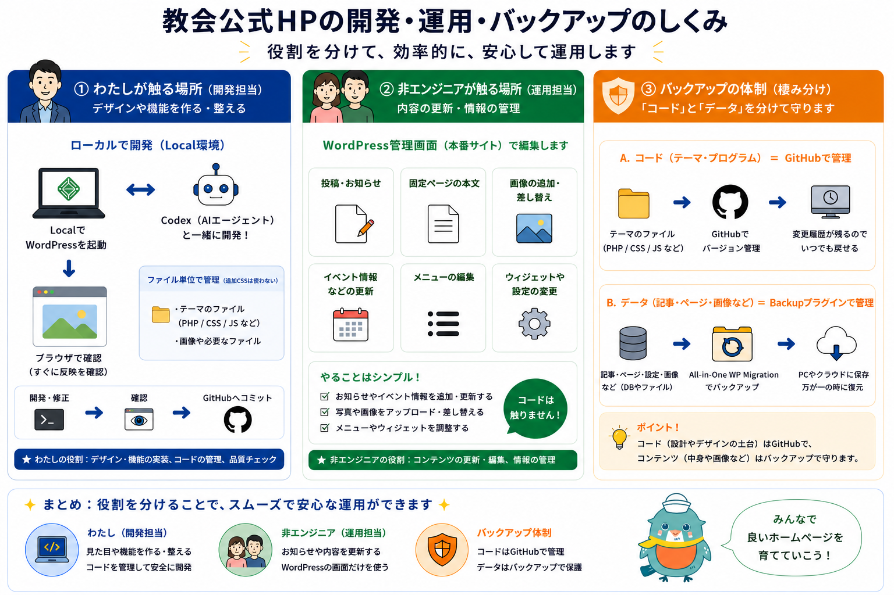

# YLT_churchHP_dev

教会公式ホームページの開発・運用・バックアップの役割分担をまとめたリポジトリです。

役割を分けることで、デザインや機能の変更、日々のコンテンツ更新、万が一に備えたバックアップを安全に進めます。

## 概要図

## 全体方針

- 開発担当はローカル環境でテーマやコードを編集します。
- 運用担当はWordPress管理画面から本文や画像などのコンテンツを編集します。
- コードとデータを分けて管理します。
- コードはGitHubで履歴管理します。
- 記事、固定ページ、画像、設定などのデータはバックアッププラグインで保護します。

## 1. 開発担当が触る場所

開発担当は、Local環境でWordPressを起動し、Codexなどの開発支援ツールを使いながらテーマの調整を行います。

主に扱う内容は以下です。

- テーマファイル
- PHP
- CSS
- JavaScript
- 画像やその他のテーマ用ファイル
- デザイン調整
- 機能追加
- 品質チェック

基本的な作業の流れは以下です。

1. Local環境で開発・修正する
2. ブラウザで表示を確認する
3. 問題がなければGitHubへコミットする

## 2. 運用担当が触る場所

運用担当は、WordPress管理画面から本番サイトの内容を編集します。

コードは触らず、管理画面だけで作業します。

主に扱う内容は以下です。

- 投稿・お知らせ
- 固定ページの本文
- 画像の追加・差し替え
- イベント情報などの更新
- メニューの編集
- ウィジェットや一部設定の変更

運用担当の役割は、コンテンツの更新、編集、情報管理です。

## 3. バックアップの考え方

このサイトでは、コードとデータを分けて守ります。

### コード

テーマやプログラムのファイルはGitHubで管理します。

対象の例は以下です。

- テーマファイル
- PHP
- CSS
- JavaScript
- テーマ内で管理する画像や必要ファイル

GitHubで管理することで、変更履歴が残り、必要に応じて以前の状態へ戻せます。

### データ

記事、固定ページ、画像、設定などのWordPress上のデータは、バックアッププラグインで管理します。

対象の例は以下です。

- 投稿
- 固定ページ
- メディア画像
- WordPress設定
- データベース

バックアップには、All-in-One WP Migrationなどのプラグインを使います。

バックアップデータは、PCやクラウドなど複数の場所に保存しておくと安心です。

## 管理ルール

- デザインや機能の変更は、開発担当がローカル環境で行います。
- 投稿、ページ本文、画像差し替えなどは、運用担当がWordPress管理画面で行います。
- CSSやPHPの変更は、GitHubに履歴を残します。
- WordPressのコンテンツやデータベースは、定期的にバックアップします。
- コードを編集する人と、コンテンツを編集する人の作業範囲を分けます。

## この子テーマの主なファイル

- `style.css`: WordPressに子テーマとして認識させるためのテーマ情報ファイルです。
- `functions.php`: CSSの読み込みや、子テーマ側のPHP処理を追加するファイルです。
- `assets/css/custom.css`: サイトの見た目を調整するためのCSSファイルです。

## まとめ

開発担当、運用担当、バックアップ体制の役割を分けることで、安心してホームページを育てていけます。

- 開発担当: 見た目や機能を作る・整える
- 運用担当: お知らせや内容を更新する
- バックアップ体制: コードとデータを分けて守る
